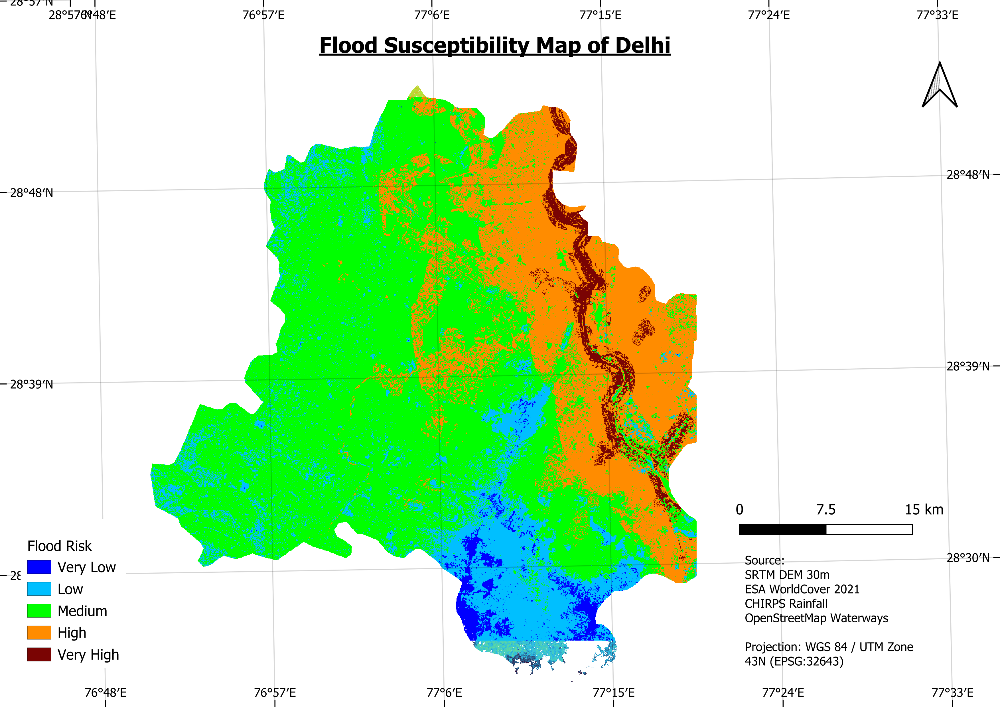
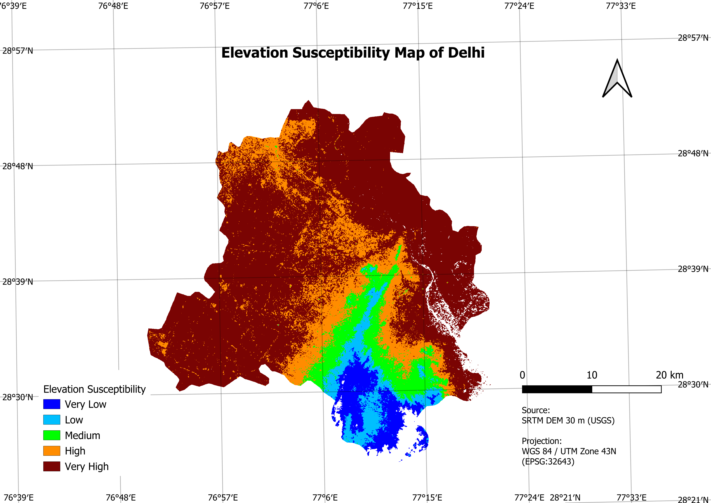
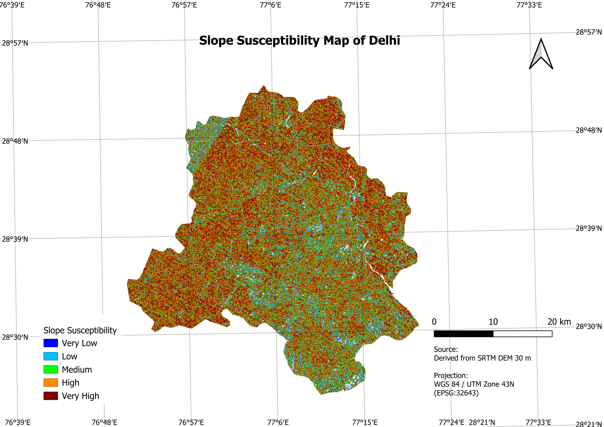
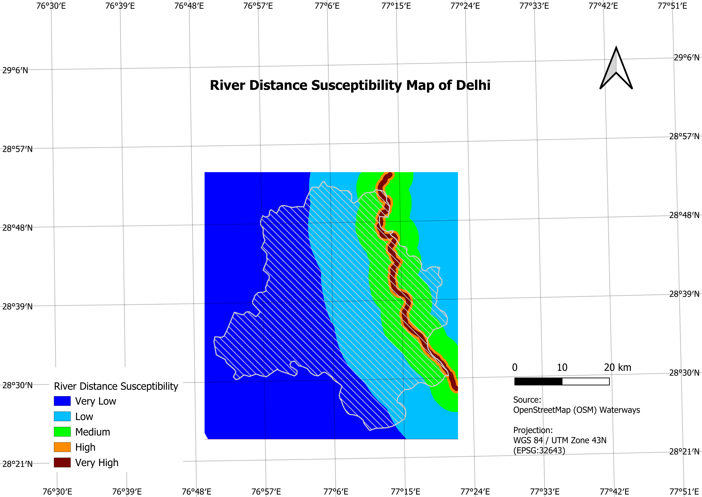
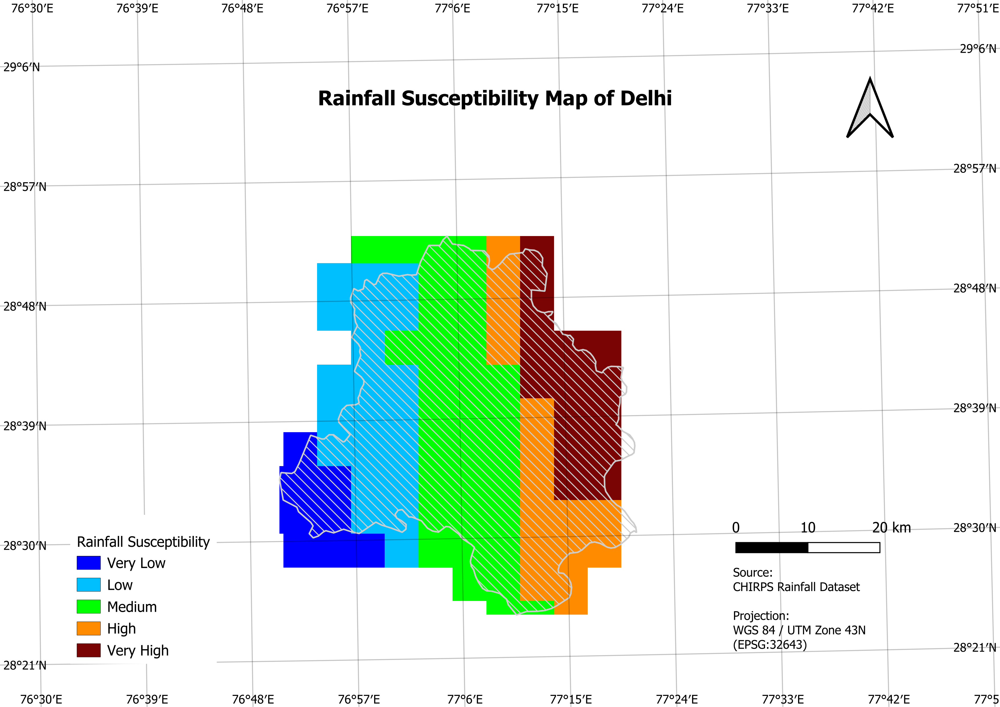
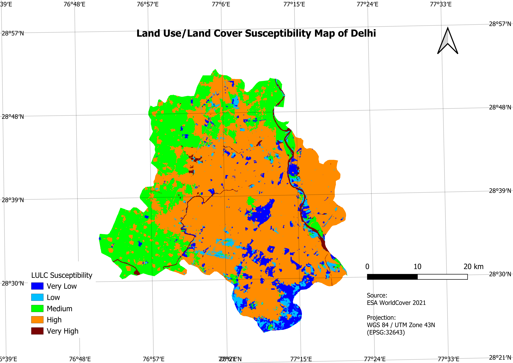

# 🌊 Flood Susceptibility Mapping of Delhi using GIS and MCDM

A GIS-based flood susceptibility assessment of Delhi using Multi-Criteria Decision Making (MCDM) and Weighted Overlay Analysis in QGIS. The study integrates elevation, slope, rainfall, land use/land cover (LULC), and river proximity to identify flood-prone zones across Delhi.

---

## 🌍 Final Flood Susceptibility Map



**Figure:** Final Flood Susceptibility Map of Delhi generated using GIS-based Multi-Criteria Decision Making (MCDM) and Weighted Overlay Analysis.

---

## 📖 Project Summary

Flooding is one of the major environmental hazards affecting urban areas. Delhi is particularly vulnerable due to the presence of the Yamuna River, rapid urbanization, increasing impervious surfaces, and changing rainfall patterns.

This project utilizes Remote Sensing, Geographic Information Systems (GIS), and Multi-Criteria Decision Making (MCDM) techniques to generate a Flood Susceptibility Map of Delhi. The final map classifies the study area into five flood susceptibility zones ranging from Very Low to Very High risk.

---

## 🎯 Objectives

- Identify flood-prone areas within Delhi.
- Generate flood conditioning factor layers using GIS techniques.
- Apply Multi-Criteria Decision Making (MCDM).
- Perform Weighted Overlay Analysis.
- Develop a Flood Susceptibility Map for disaster management and urban planning.

---

## 🗺️ Study Area

| Parameter | Description |
|------------|------------|
| Location | Delhi, India |
| Projection | WGS 84 / UTM Zone 43N (EPSG:32643) |
| Major River | Yamuna River |
| Area | ~1484 km² |

---

## 📊 Datasets Used

| Factor | Data Source |
|----------|----------|
| Distance from River | OpenStreetMap (OSM) Waterways |
| Elevation | SRTM DEM 30 m |
| Land Use/Land Cover (LULC) | ESA WorldCover 2021 |
| Rainfall | CHIRPS Rainfall Dataset |
| Slope | Derived from SRTM DEM |

---

## ⚙️ Methodology

### Workflow

```text
Data Collection
      ↓
Data Preprocessing
      ↓
Generation of Thematic Layers
      ↓
Reclassification
      ↓
Weight Assignment
      ↓
Weighted Overlay Analysis
      ↓
Flood Susceptibility Mapping
```

---

## 🗺️ Input Factor Maps

### Study Area


### Elevation Susceptibility Map



### Slope Susceptibility Map



### River Distance Susceptibility Map



### Rainfall Susceptibility Map



### Land Use/Land Cover Susceptibility Map



---

## 🧠 Multi-Criteria Decision Making (MCDM)

Weighted Linear Combination (WLC) was adopted to integrate all flood conditioning factors into a single Flood Susceptibility Index (FSI).

### Flood Susceptibility Index

```text
FSI = Σ(Wi × Xi)
```

Where:

- **Wi** = Weight assigned to each factor
- **Xi** = Reclassified factor score

---

## 📈 Factor Weights

| Factor | Weight (%) |
|----------|----------:|
| Distance from River | 30 |
| Elevation | 25 |
| LULC | 20 |
| Rainfall | 13 |
| Slope | 12 |
| **Total** | **100** |

### Weighted Overlay Equation

```text
FSI =
(0.30 × River Distance)
+
(0.25 × Elevation)
+
(0.20 × LULC)
+
(0.13 × Rainfall)
+
(0.12 × Slope)
```

---

## 🚧 Drainage Density Analysis

Drainage density was initially investigated as a potential flood conditioning factor using hydrological analysis and OpenStreetMap waterway data.

However, due to the relatively flat topography of Delhi and limitations associated with the 30 m SRTM DEM, the generated stream network produced unrealistic drainage patterns. Therefore, drainage density was excluded from the final weighted overlay model to avoid introducing uncertainty into the results.

---

## 📊 Results

The final flood susceptibility map classified Delhi into five categories:

| Class | Susceptibility |
|---------|---------|
| 1 | Very Low |
| 2 | Low |
| 3 | Moderate |
| 4 | High |
| 5 | Very High |

## 📊 Key Findings

- Areas located along the Yamuna River exhibit **High to Very High flood susceptibility** due to low elevation and close proximity to the river.
- **River distance (30%)** and **elevation (25%)** were identified as the most influential flood conditioning factors.
- Eastern Delhi shows higher flood vulnerability, while southern and western regions generally exhibit lower susceptibility.
- Built-up areas demonstrate increased flood risk because impervious surfaces reduce infiltration and increase surface runoff.
- Low-slope regions are more prone to flooding due to slower drainage and water accumulation.
- The generated flood susceptibility pattern aligns with known flood-prone zones along the Yamuna floodplain.
- The final map can support **urban planning, disaster management, and flood mitigation strategies** in Delhi.
---

## 🛠️ Software Used

- QGIS
- Google Earth Engine
- Microsoft Excel

---

## 📂 Repository Structure

```text
Flood-Susceptibility-Mapping-of-Delhi-using-QGIS
│
├── Maps/
│   ├── Study Area.png
│   ├── elevation_map.png
│   ├── slope_map.png
│   ├── river_distance_map.png
│   ├── rainfall_map.png
│   ├── lulc_map.png
│   └── flood_susceptibility_map.png
│
├── QGIS Project/
│   └── Flood_risk_map.qgz
│
├── Report/
│   └── Flood_Susceptibility_Report.pdf
│
├── Results/
│   └── Flood_Susceptibility_Map.png
│
└── README.md
```

---

## 🚀 Applications

- Flood Risk Assessment
- Disaster Management
- Urban Planning
- Climate Resilience Planning
- Sustainable Development

---

## 🔑 Skills Demonstrated

- GIS Analysis
- Remote Sensing
- QGIS
- Spatial Analysis
- Raster Processing
- DEM Analysis
- MCDM
- Weighted Overlay Analysis
- Cartography
- Geospatial Data Visualization

## 👨‍💻 Author

**Siddharth Gupta**

B.Tech Geoinformatics  
Netaji Subhas University of Technology (NSUT)

LinkedIn: https://www.linkedin.com/in/siddharth-gupta-16b829305

---
